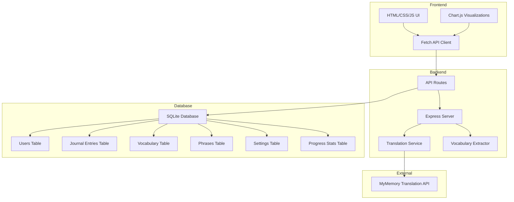

# DeutschTagebuch - Enhanced Architecture Plan

## Overview
Transform the existing single-file HTML app into a full-stack application with Node.js/Express backend and SQLite database for persistent storage, automatic translation, and comprehensive progress tracking.

## System Architecture



## Database Schema

### journal_entries
- `id` INTEGER PRIMARY KEY AUTOINCREMENT
- `user_id` INTEGER (for future multi-user support)
- `english_text` TEXT
- `german_text` TEXT
- `created_at` DATETIME
- `word_count` INTEGER
- `session_duration` INTEGER (minutes)

### vocabulary
- `id` INTEGER PRIMARY KEY AUTOINCREMENT
- `user_id` INTEGER
- `word` TEXT UNIQUE
- `first_seen` DATETIME
- `frequency` INTEGER (how many times appeared)
- `last_reviewed` DATETIME

### custom_phrases
- `id` INTEGER PRIMARY KEY AUTOINCREMENT
- `user_id` INTEGER
- `english` TEXT
- `german` TEXT
- `created_at` DATETIME
- `times_reviewed` INTEGER

### user_settings
- `id` INTEGER PRIMARY KEY AUTOINCREMENT
- `user_id` INTEGER UNIQUE
- `daily_goal_minutes` INTEGER DEFAULT 60
- `daily_sentence_goal` INTEGER DEFAULT 10
- `theme` TEXT DEFAULT 'light'

### progress_stats
- `id` INTEGER PRIMARY KEY AUTOINCREMENT
- `user_id` INTEGER
- `date` DATE UNIQUE
- `words_learned` INTEGER
- `entries_written` INTEGER
- `minutes_practiced` INTEGER

## API Endpoints

### Journal Endpoints
- `POST /api/journal/entry` - Create new journal entry
- `GET /api/journal/entries` - Get all entries (with pagination)
- `GET /api/journal/entry/:id` - Get specific entry
- `PUT /api/journal/entry/:id` - Update entry
- `DELETE /api/journal/entry/:id` - Delete entry
- `GET /api/journal/search?q=term` - Search entries

### Vocabulary Endpoints
- `GET /api/vocabulary` - Get all vocabulary words
- `POST /api/vocabulary` - Add word manually
- `DELETE /api/vocabulary/:id` - Remove word
- `GET /api/vocabulary/stats` - Get vocabulary statistics

### Translation Endpoint
- `POST /api/translate` - Translate English text to German

### Phrases Endpoints
- `GET /api/phrases` - Get all phrases (built-in + custom)
- `POST /api/phrases` - Add custom phrase
- `DELETE /api/phrases/:id` - Delete custom phrase

### Progress Endpoints
- `GET /api/progress/streak` - Get current streak count
- `GET /api/progress/stats` - Get overall statistics
- `GET /api/progress/history?days=30` - Get daily progress history

### Settings Endpoints
- `GET /api/settings` - Get user settings
- `PUT /api/settings` - Update settings

### Data Management Endpoints
- `GET /api/export` - Export all data as JSON
- `POST /api/import` - Import data from JSON backup

## Key Features Implementation

### 1. Automatic Translation
- User types English sentences in left panel
- Clicks "Translate" button
- Backend calls MyMemory API
- German translation appears in right panel
- User can edit German version before saving

### 2. Vocabulary Auto-Extraction
- When saving journal entry, backend extracts German words
- Filters out common stop words (der, die, das, ich, etc.)
- Checks against existing vocabulary table
- Only adds new unique words
- Increments frequency counter for existing words

### 3. Streak Tracking
- Daily entry automatically updates progress_stats table
- Streak calculated by counting consecutive days with entries
- Resets if a day is missed
- Shows current streak and personal best on dashboard

### 4. Progress Visualization
- Chart.js fetches real data from `/api/progress/history`
- Displays words learned, entries written, time practiced
- 7-day, 30-day, and all-time views

### 5. Search & Filter
- Full-text search across all journal entries
- Filter by date range
- Sort by newest/oldest/word count

## Technology Stack

### Frontend
- HTML5, CSS3 (Tailwind CDN)
- Vanilla JavaScript
- Chart.js for visualizations
- Fetch API for backend communication

### Backend
- Node.js v18+
- Express.js framework
- SQLite3 (better-sqlite3 package)
- Axios for MyMemory API calls
- CORS middleware

### Database
- SQLite3 (single file database)
- Stored as `deutschtagebuch.db`

## File Structure

```
/Fluent_man
├── index.html              (existing frontend)
├── server.js               (Express server)
├── package.json            (dependencies)
├── deutschtagebuch.db      (SQLite database)
├── /backend
│   ├── /routes
│   │   ├── journal.js
│   │   ├── vocabulary.js
│   │   ├── phrases.js
│   │   ├── progress.js
│   │   ├── settings.js
│   │   └── translate.js
│   ├── /services
│   │   ├── translation.js
│   │   └── vocabulary-extractor.js
│   ├── /models
│   │   └── database.js
│   └── /migrations
│       └── init.sql
└── /plans
    └── architecture.md     (this file)
```

## Development Phases

### Phase 1: Backend Setup
- Initialize Node.js project
- Set up Express server
- Create SQLite database schema
- Test basic CRUD operations

### Phase 2: Core API Development
- Implement all REST endpoints
- Add translation service integration
- Create vocabulary extraction logic
- Add error handling and validation

### Phase 3: Frontend Integration
- Update JavaScript to use fetch API
- Replace mock data with real API calls
- Add loading states and error messages
- Implement translate button

### Phase 4: Enhanced Features
- Add streak tracking
- Implement search and filtering
- Create export/import functionality
- Add settings management

### Phase 5: Polish & Testing
- Test all features end-to-end
- Add offline detection
- Create startup documentation
- Optimize performance

## Security Considerations

- Input validation on all endpoints
- Sanitize user input to prevent SQL injection
- Rate limiting on translation API calls
- CORS configuration for frontend-backend
- Optional: Simple session-based auth for multi-user support

## Performance Optimizations

- Database indexes on frequently queried columns
- Pagination for large datasets
- Caching of translation results
- Lazy loading of journal entries
- Batch vocabulary extraction

## Future Enhancements (Post-MVP)

- Audio pronunciation for vocabulary
- Spaced repetition for vocabulary review
- Grammar checking integration
- Mobile responsive PWA features
- Multi-user support with authentication
- Cloud sync option (optional)