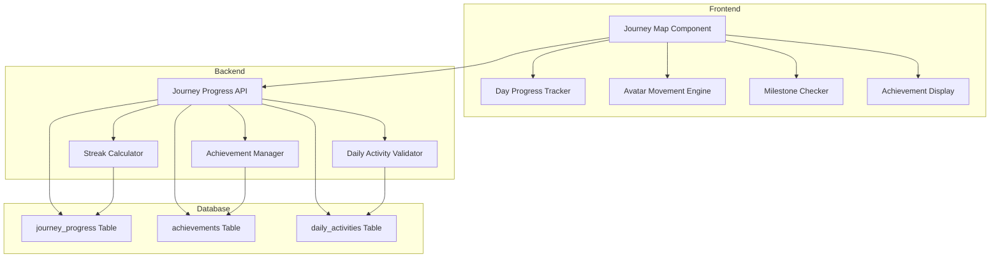
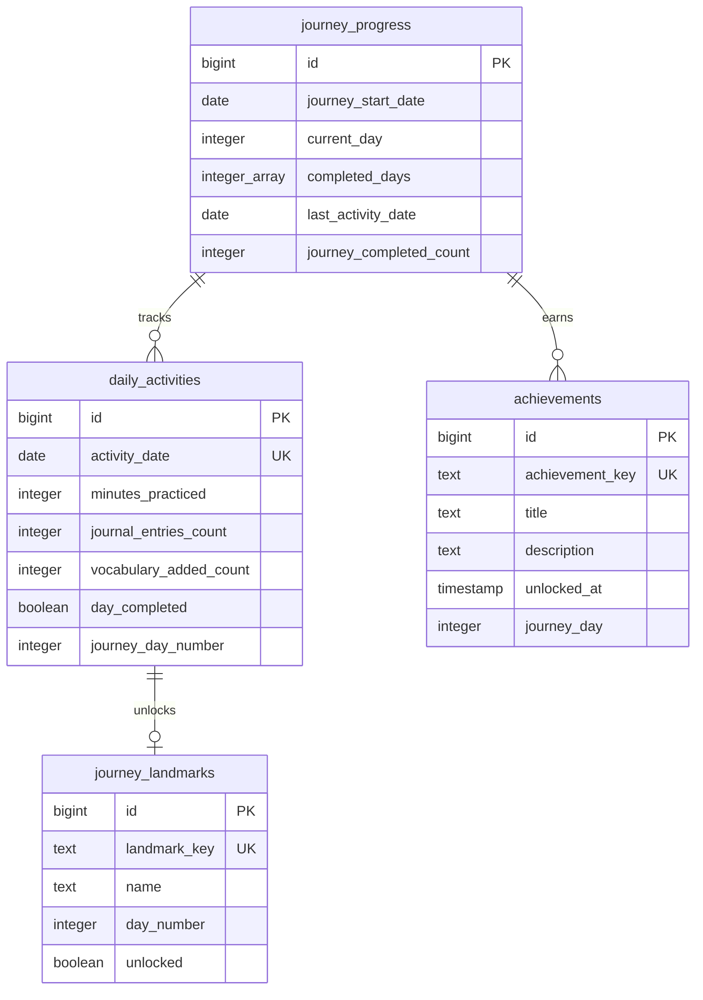
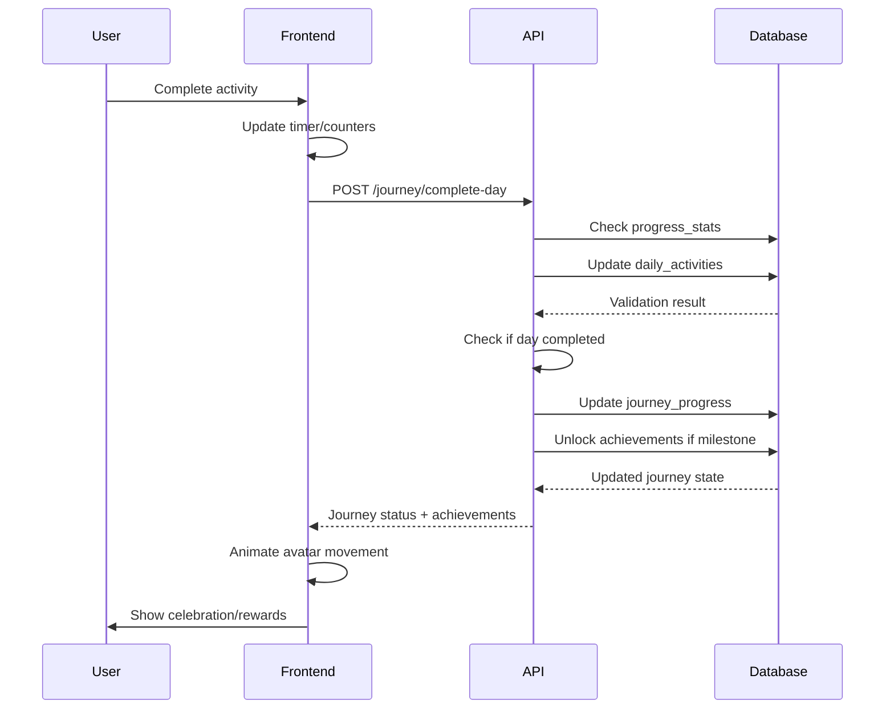

# 30-Day Journey Map System - Architecture Design

## Executive Summary

A gamified 30-day learning journey map feature for DeutschTagebuch that transforms daily practice into an immersive One Piece-themed adventure. The system tracks user progress through a continuous 30-day cycle, visualized as an interactive nautical map with character avatars, landmark islands, and achievement milestones.

---

## 1. System Architecture

### 1.1 High-Level Overview



### 1.2 Integration with Existing Systems

**Leverages Existing Data:**
- [`progress_stats`](backend-worker/supabase-schema.sql:54) table for daily activity tracking
- [`journal_entries`](backend-worker/supabase-schema.sql:8) for journal completion
- [`vocabulary`](backend-worker/supabase-schema.sql:27) for word learning
- [`/progress/streak`](backend-worker/routes/progress.js:90) endpoint for streak calculation
- [`/progress/active-days`](backend-worker/routes/progress.js:272) for total days calculation

**New Components Required:**
- Journey progress tracking table
- Achievement badge system
- Landmark unlock mechanism
- Avatar position state management

---

## 2. Data Model

### 2.1 New Database Tables

```sql
-- Journey Progress Table
CREATE TABLE IF NOT EXISTS journey_progress (
  id BIGSERIAL PRIMARY KEY,
  user_id BIGINT DEFAULT 1, -- Single user for now, expandable later
  journey_start_date DATE NOT NULL,
  current_day INTEGER DEFAULT 1 CHECK (current_day >= 1 AND current_day <= 30),
  completed_days INTEGER[] DEFAULT ARRAY[]::INTEGER[], -- Array of completed day numbers
  last_activity_date DATE,
  journey_completed_count INTEGER DEFAULT 0, -- How many 30-day journeys completed
  created_at TIMESTAMP WITH TIME ZONE DEFAULT NOW(),
  updated_at TIMESTAMP WITH TIME ZONE DEFAULT NOW()
);

-- Daily Activities Table (detailed tracking)
CREATE TABLE IF NOT EXISTS daily_activities (
  id BIGSERIAL PRIMARY KEY,
  activity_date DATE NOT NULL UNIQUE,
  minutes_practiced INTEGER DEFAULT 0,
  journal_entries_count INTEGER DEFAULT 0,
  vocabulary_added_count INTEGER DEFAULT 0,
  day_completed BOOLEAN DEFAULT FALSE,
  journey_day_number INTEGER, -- Which day of the 30-day journey
  created_at TIMESTAMP WITH TIME ZONE DEFAULT NOW(),
  updated_at TIMESTAMP WITH TIME ZONE DEFAULT NOW()
);

-- Achievements Table
CREATE TABLE IF NOT EXISTS achievements (
  id BIGSERIAL PRIMARY KEY,
  achievement_key TEXT UNIQUE NOT NULL, -- e.g., 'day_7_milestone', 'first_journey_complete'
  title TEXT NOT NULL,
  description TEXT,
  icon_emoji TEXT, -- Emoji or icon identifier
  unlocked_at TIMESTAMP WITH TIME ZONE,
  journey_day INTEGER, -- Which day it was unlocked on (1-30)
  category TEXT DEFAULT 'milestone' -- 'milestone', 'streak', 'special'
);

-- Landmarks Table (islands/zones on the map)
CREATE TABLE IF NOT EXISTS journey_landmarks (
  id BIGSERIAL PRIMARY KEY,
  landmark_key TEXT UNIQUE NOT NULL, -- e.g., 'grammar_fort', 'vocab_island'
  name TEXT NOT NULL,
  description TEXT,
  icon_emoji TEXT,
  day_number INTEGER NOT NULL, -- Which day this landmark appears on
  unlocked BOOLEAN DEFAULT FALSE,
  unlocked_at TIMESTAMP WITH TIME ZONE
);

-- Create indexes
CREATE INDEX IF NOT EXISTS idx_daily_activities_date ON daily_activities(activity_date DESC);
CREATE INDEX IF NOT EXISTS idx_achievements_unlocked ON achievements(unlocked_at DESC);
CREATE INDEX IF NOT EXISTS idx_landmarks_day ON journey_landmarks(day_number);
```

### 2.2 Data Relationships



---

## 3. UI/UX Design

### 3.1 Journey Map Layout

**Visual Structure:**
```
┌─────────────────────────────────────────────────────────────┐
│  🏴‍☠️ 30-Day Grand Line Journey    Day [X] of 30          │
├─────────────────────────────────────────────────────────────┤
│                                                             │
│  ⚓ Start  ───🌊───→  ⛵ Day 7  ───🌊───→  🏝️ Day 14       │
│   Island           Grammar Fort        Vocab Island        │
│                                                             │
│           ───🌊───→  ⚔️ Day 21  ───🌊───→  💎 Day 30      │
│                    Quiz Bridge        Treasure Island      │
│                                                             │
│  [🚢 Avatar positioned at current day]                     │
│                                                             │
├─────────────────────────────────────────────────────────────┤
│  Progress: ▓▓▓▓▓▓▓▓░░░░░░░░░░░░ [X/30 days]               │
│  Today's Activity: ⏱️ [X] mins  ✍️ [X] entries  📚 [X] words│
└─────────────────────────────────────────────────────────────┘
```

### 3.2 Interactive Elements

**Day Waypoints:**
- **Completed Days**: Glowing gold anchor icons ⚓
- **Current Day**: Animated ship avatar 🚢 with pulsing glow
- **Future Days**: Dimmed/grayed out waypoints
- **Milestone Days (7, 14, 21, 30)**: Larger landmark icons with special styling

**Hover States:**
- Show day number, date completed, and activities performed
- Display mini summary: "Day 15: Oct 15, 2024 - 25 mins, 2 entries, 8 words"

**Click Actions:**
- Current Day: Show today's progress modal with detailed stats
- Completed Days: Show historical data and achievements earned that day
- Future Days: Show what unlocks at that milestone

### 3.3 Landmark Islands

**Themed Zones Along the Journey:**

| Day | Landmark | Icon | Theme | Unlocks |
|-----|----------|------|-------|---------|
| 1 | East Blue Harbor | 🏴‍☠️ | Starting point | Journey begins badge |
| 7 | Grammar Fort | ⚓ | Grammar mastery zone | "Week Warrior" badge |
| 14 | Vocab Island | 🏝️ | Vocabulary treasure | "Vocab Collector" badge |
| 21 | Quiz Bridge | ⚔️ | Challenge zone | "Three Weeks Strong" badge |
| 30 | Treasure Island | 💎 | Final destination | "Journey Complete" badge + special rewards |

**Special Landmarks (Variable):**
- Audio Island: Appears on days with pronunciation practice
- Phrase Port: Appears on days with phrase learning
- Story Sea: Appears on days with longer journal entries

### 3.4 Avatar Movement Animations

**Movement Triggers:**
- When a day is completed (10+ minutes practice), avatar "sails" to next position
- Smooth CSS transition animation with ship bobbing effect
- Trail effect showing the path traveled (dotted line connecting waypoints)

**Celebration Effects:**
```javascript
// Pseudo-code for celebration
onDayComplete(dayNumber) {
  if (isMilestone(dayNumber)) {
    triggerFireworks();
    showAchievementModal();
    unlockLandmark();
  } else {
    showConfetti();
    playShipHorn();
  }
  moveAvatarToPosition(dayNumber);
  updateProgressBar();
}
```

### 3.5 Responsive Design

**Desktop (>1024px):**
- Full horizontal journey map with all 30 days visible
- Avatar and landmarks rendered at full size
- Detailed hover tooltips

**Tablet (768px-1024px):**
- Scrollable horizontal map
- Slightly compressed waypoint spacing
- Touch-friendly tap interactions

**Mobile (<768px):**
- Vertical timeline layout (stacked waypoints)
- Swipe to scroll through journey
- Tap to expand day details
- Simplified animations for performance

---

## 4. Gamification Mechanics

### 4.1 Daily Progress Requirements

**Completion Criteria:**
```javascript
function isDayCompleted(activities) {
  const { minutes_practiced, journal_entries_count, vocabulary_added_count } = activities;
  
  // Primary: 10+ minutes of practice time
  if (minutes_practiced >= 10) {
    return true;
  }
  
  // Alternative: Significant activity without timer
  if (journal_entries_count >= 1 || vocabulary_added_count >= 5) {
    return true;
  }
  
  return false;
}
```

**Progress Tracking:**
- Timer continues running from [`state.timer`](frontend/app.js:9) in app.js
- Journal entries from [`processEntry()`](frontend/app.js:452) function
- Vocabulary from [`addWord()`](frontend/app.js:851) function

### 4.2 Streak System Integration

**Leverages Existing Streak Logic:**
- Uses current [`/progress/streak`](backend-worker/routes/progress.js:90) endpoint
- Journey progress updates independently
- Streak can continue across multiple 30-day journeys

**Edge Cases:**
- If streak breaks, journey continues (journey day != calendar day)
- User can have completed 15 journey days over 20 calendar days
- Journey resets after 30 completed days, not 30 calendar days

### 4.3 Milestone Rewards

**Day 7 - "Grammar Fort" Achievement:**
- Badge: "Week Warrior" ⚓
- Unlock: Special grammar tips in notes section
- Visual: Fort icon lights up on map

**Day 14 - "Vocab Island" Achievement:**
- Badge: "Vocab Collector" 🏝️
- Unlock: Vocabulary categories folder organization
- Visual: Island reveals treasure chest icon

**Day 21 - "Quiz Bridge" Achievement:**
- Badge: "Three Weeks Strong" ⚔️
- Unlock: Self-quiz mode (match German to English)
- Visual: Bridge completes with golden glow

**Day 30 - "Treasure Island" Achievement:**
- Badge: "Journey Complete" 💎
- Unlock: Special "One Piece" achievement poster
- Rewards: 
  - Journey completion certificate
  - Stat summary (total words learned, entries written)
  - Option to start new journey with bonus level
- Visual: Fireworks animation, treasure chest opening

### 4.4 Progress Percentage Calculation

```javascript
function calculateJourneyProgress(completedDays) {
  const totalDays = 30;
  const completed = completedDays.length; // Array of completed day numbers
  const percentage = (completed / totalDays) * 100;
  
  return {
    completed,
    total: totalDays,
    percentage: Math.round(percentage),
    remaining: totalDays - completed
  };
}
```

### 4.5 Special Achievements

**Beyond Milestones:**
- "Speed Runner": Complete 7 days in 7 consecutive calendar days
- "Dedicated Pirate": 50+ minutes practiced in a single day
- "Word Hoarder": Add 20+ vocabulary words in one day
- "Story Teller": Write journal entry with 100+ words
- "Grand Fleet": Complete 3 full 30-day journeys

---

## 5. Technical Specifications

### 5.1 Backend API Endpoints

**New Endpoints Required:**

```javascript
// GET /api/journey/current
// Returns current journey status
Response: {
  journey_start_date: "2024-01-01",
  current_day: 15,
  completed_days: [1, 2, 3, 5, 7, 8, 10, 11, 12, 13, 14, 15],
  total_completed: 12,
  percentage: 40,
  next_milestone: 21,
  days_until_milestone: 6
}

// POST /api/journey/complete-day
// Marks current day as complete
Request: {
  date: "2024-01-15",
  minutes_practiced: 25,
  journal_entries: 1,
  vocabulary_added: 5
}
Response: {
  success: true,
  day_completed: true,
  journey_day: 15,
  milestone_reached: false,
  achievements_unlocked: []
}

// GET /api/journey/achievements
// Returns all achievements
Response: {
  unlocked: [
    { key: "day_7_milestone", title: "Week Warrior", unlocked_at: "..." }
  ],
  locked: [
    { key: "day_14_milestone", title: "Vocab Collector", required_day: 14 }
  ]
}

// GET /api/journey/landmarks
// Returns landmarks with unlock status
Response: [
  { name: "Grammar Fort", day: 7, unlocked: true, icon: "⚓" },
  { name: "Vocab Island", day: 14, unlocked: false, icon: "🏝️" }
]

// POST /api/journey/reset
// Starts a new 30-day journey (after completion)
Response: {
  new_journey_start_date: "2024-02-01",
  journey_count: 2
}
```

### 5.2 Frontend Component Structure

```
JourneyMapComponent/
├── JourneyMap.js           # Main container
├── JourneyTimeline.js      # Horizontal/vertical timeline
├── DayWaypoint.js          # Individual day marker
├── AvatarShip.js           # User's position indicator
├── Landmark.js             # Milestone island component
├── ProgressBar.js          # Overall progress visualization
├── AchievementModal.js     # Achievement unlock popup
├── DayDetailModal.js       # Day stats popup
└── MilestoneReward.js      # Celebration component
```

### 5.3 State Management

**Global State (in [`app.js`](frontend/app.js:6)):**

```javascript
const state = {
  // ... existing state
  journey: {
    currentDay: 1,
    completedDays: [],
    startDate: null,
    todayCompleted: false,
    achievements: [],
    landmarks: [],
    avatarPosition: 1
  }
};
```

**State Update Flow:**


### 5.4 Animation System

**CSS Keyframe Animations:**

```css
/* Ship sailing animation */
@keyframes sail-forward {
  0% { transform: translateX(0) translateY(0); }
  25% { transform: translateX(25%) translateY(-5px); }
  50% { transform: translateX(50%) translateY(0); }
  75% { transform: translateX(75%) translateY(-5px); }
  100% { transform: translateX(100%) translateY(0); }
}

/* Waypoint unlock glow */
@keyframes waypoint-unlock {
  0% { box-shadow: 0 0 0 0 rgba(255, 215, 0, 0.7); }
  50% { box-shadow: 0 0 20px 10px rgba(255, 215, 0, 0.3); }
  100% { box-shadow: 0 0 0 0 rgba(255, 215, 0, 0); }
}

/* Achievement popup */
@keyframes achievement-bounce-in {
  0% { transform: scale(0) rotate(-180deg); opacity: 0; }
  50% { transform: scale(1.2) rotate(10deg); }
  100% { transform: scale(1) rotate(0deg); opacity: 1; }
}

/* Fireworks effect */
@keyframes firework {
  0% { transform: translate(0, 0); opacity: 1; }
  100% { transform: translate(var(--x), var(--y)); opacity: 0; }
}
```

**JavaScript Trigger Logic:**

```javascript
function animateAvatarMovement(fromDay, toDay) {
  const avatar = document.querySelector('.journey-avatar');
  const fromPosition = getWaypointPosition(fromDay);
  const toPosition = getWaypointPosition(toDay);
  
  avatar.style.setProperty('--from-x', fromPosition.x);
  avatar.style.setProperty('--to-x', toPosition.x);
  avatar.classList.add('sailing');
  
  setTimeout(() => {
    avatar.classList.remove('sailing');
    if (isMilestone(toDay)) {
      showMilestoneCelebration(toDay);
    }
  }, 2000); // Animation duration
}
```

### 5.5 Performance Optimization

**Strategies:**
1. **Lazy Loading**: Load landmarks and achievements only when visible
2. **Debouncing**: Throttle progress updates to max 1 per second
3. **Virtual Scrolling**: For mobile vertical timeline
4. **CSS Transforms**: Use `translate3d` for GPU acceleration
5. **Image Sprites**: Combine landmark icons into sprite sheet
6. **Memoization**: Cache waypoint positions and calculations

**Bundle Size Considerations:**
- Keep journey map component code-split
- Load celebration animations on-demand
- Use CSS for animations instead of JS libraries

---

## 6. Implementation Phases

### Phase 1: Database & Backend Foundation
- Create new database tables with migrations
- Build `/api/journey/*` endpoints
- Implement daily activity validation logic
- Create achievement seeding script

### Phase 2: Core Journey Logic
- Build journey progress calculator
- Implement day completion checker
- Create milestone detection system
- Build achievement unlock system

### Phase 3: Basic UI Components
- Create JourneyMap container component
- Build timeline with waypoints
- Add avatar ship component
- Implement progress bar

### Phase 4: Interactive Features
- Add waypoint click handlers
- Build day detail modal
- Implement hover tooltips
- Add basic animations

### Phase 5: Gamification & Celebrations
- Build achievement modal with animations
- Implement milestone celebrations
- Add fireworks/confetti effects
- Create landmark unlock animations

### Phase 6: Integration & Polish
- Integrate with existing timer system
- Connect to journal/vocabulary tracking
- Add responsive mobile layout
- Optimize animations and performance

### Phase 7: Testing & Refinement
- Test journey reset logic
- Validate achievement unlocking
- Test across devices
- Performance testing
- User acceptance testing

---

## 7. Integration with Existing Features

### 7.1 Timer Integration

**Current System:**
- Timer in [`state.timer`](frontend/app.js:9) tracks seconds
- Updates via [`updateTimerDisplay()`](frontend/app.js:116)
- Session duration saved with journal entries

**Journey Integration:**
- Listen for timer updates
- Calculate cumulative daily minutes
- Auto-complete day when threshold reached (10 min)
- Show toast notification: "Day X completed! 🎉"

**Code Hook:**
```javascript
// In updateTimerDisplay()
const minutes = Math.floor(state.timer / 60);
if (minutes >= 10 && !state.journey.todayCompleted) {
  completeTodaysJourneyDay();
  showDayCompletionToast();
}
```

### 7.2 Journal Entry Integration

**Current System:**
- [`processEntry()`](frontend/app.js:452) saves entries
- Increments `progress_stats.entries_written`

**Journey Integration:**
```javascript
// In processEntry() after successful save
await updateDailyActivity({
  journal_entries_count: 1
});
checkIfDayCompleted();
```

### 7.3 Vocabulary Integration

**Current System:**
- [`addWord()`](frontend/app.js:851) adds vocabulary
- Updates `vocabulary` table

**Journey Integration:**
```javascript
// In addWord() after successful addition
await updateDailyActivity({
  vocabulary_added_count: 1
});
checkIfDayCompleted();
```

### 7.4 Dashboard Placement

**Replace Current:**
- Current simple horizontal timeline at lines 1000-1091 in [`index.html`](frontend/index.html:1000)
- Replace with full interactive journey map component

**Layout:**
```html
<!-- Current Location: Dashboard Section -->
<section id="dashboard">
  <header>...</header>
  
  <!-- NEW: Journey Map Component -->
  <div id="journey-map-container" class="journey-map">
    <!-- Rendered by JourneyMap.js -->
  </div>
  
  <!-- Stats cards below map -->
  <div class="stats-grid">...</div>
</section>
```

---

## 8. Edge Cases & Error Handling

### 8.1 Journey Reset Scenarios

**Scenario 1: User completes 30 days**
- Show completion celebration
- Update `journey_completed_count`
- Present "Start New Journey" button
- Archive previous journey data

**Scenario 2: User inactive for extended period**
- Journey continues from where they left off
- No penalty for gaps (journey days ≠ calendar days)
- Show motivational message on return

**Scenario 3: Multiple activities in one day**
- Allow multiple journal entries and vocab additions
- Count once toward journey completion
- Track all activities for stats

### 8.2 Data Validation

**Backend Validation:**
```javascript
// Prevent backdating
if (activityDate > today) {
  throw new Error('Cannot log future activity');
}

// Prevent duplicate completion
if (alreadyCompleted(date, journeyDay)) {
  return { success: true, message: 'Day already completed' };
}

// Validate journey day bounds
if (journeyDay < 1 || journeyDay > 30) {
  throw new Error('Invalid journey day number');
}
```

### 8.3 Sync Issues

**Problem:** User offline, activities logged but not synced

**Solution:**
- Store pending activities in localStorage
- Sync when connection restored
- Prevent duplicate day completions via server-side deduplication

```javascript
async function syncPendingActivities() {
  const pending = localStorage.getItem('pending_journey_activities');
  if (!pending) return;
  
  const activities = JSON.parse(pending);
  for (const activity of activities) {
    try {
      await api.post('/journey/complete-day', activity);
    } catch (error) {
      console.error('Sync failed:', error);
    }
  }
  localStorage.removeItem('pending_journey_activities');
}
```

---

## 9. Accessibility Considerations

### 9.1 Screen Reader Support

- All waypoints have descriptive `aria-label`: "Day 15, completed on October 15, Grammar Fort milestone"
- Achievement modals have `role="dialog"` and `aria-labelledby`
- Progress bar has `aria-valuenow`, `aria-valuemin`, `aria-valuemax`
- Avatar position announced: "You are currently at day 15 of 30"

### 9.2 Keyboard Navigation

- Tab through waypoints in sequential order
- Enter/Space to open day details
- Arrow keys to navigate timeline
- Escape to close modals

### 9.3 Reduced Motion

```css
@media (prefers-reduced-motion: reduce) {
  .journey-avatar,
  .waypoint-unlock,
  .achievement-popup {
    animation: none !important;
    transition: none !important;
  }
}
```

### 9.4 Color Contrast

- Waypoint states have 4.5:1 contrast minimum
- Icons include text labels for clarity
- Use patterns in addition to colors (completed = checkmark + gold)

---

## 10. Testing Strategy

### 10.1 Unit Tests

```javascript
describe('Journey Progress Calculator', () => {
  test('calculates correct percentage', () => {
    const completed = [1, 2, 3, 5, 7];
    const result = calculateJourneyProgress(completed);
    expect(result.percentage).toBe(17); // 5/30 rounded
  });
  
  test('detects milestones correctly', () => {
    expect(isMilestone(7)).toBe(true);
    expect(isMilestone(8)).toBe(false);
  });
});

describe('Day Completion Logic', () => {
  test('10 minutes marks day complete', () => {
    const activities = { minutes_practiced: 10 };
    expect(isDayCompleted(activities)).toBe(true);
  });
  
  test('1 journal entry marks day complete', () => {
    const activities = { journal_entries_count: 1 };
    expect(isDayCompleted(activities)).toBe(true);
  });
});
```

### 10.2 Integration Tests

- Test journey initialization on first load
- Test day completion triggers achievement unlock
- Test journey reset after 30 days
- Test sync after offline period

### 10.3 Manual Testing Checklist

- [ ] Desktop responsive layout (1920px, 1366px)
- [ ] Tablet layout (768px)
- [ ] Mobile layout (375px, 414px)
- [ ] Avatar animations smooth at 60fps
- [ ] Milestone celebrations trigger correctly
- [ ] Achievement modals display properly
- [ ] Keyboard navigation works
- [ ] Screen reader announces progress
- [ ] Works offline with pending sync
- [ ] Journey resets correctly after 30 days

---

## 11. Future Enhancements

### 11.1 Multi-Journey Support

- Track lifetime journey completions
- "Grand Fleet" view showing all completed journeys
- Comparison stats between journeys
- Journey leaderboard (if multi-user)

### 11.2 Customization

- Choose avatar character (Luffy, Zoro, Nami, etc.)
- Custom journey themes (different island types)
- Personal milestone goals
- Custom achievement challenges

### 11.3 Social Features

- Share journey completion on social media
- Export journey certificate as image
- Journey replay/highlight reel
- Compare progress with friends

### 11.4 Advanced Gamification

- Daily challenges beyond 10-minute minimum
- Combo bonuses for consecutive days
- Power-ups for extra motivation
- Easter eggs hidden on the map

---

## 12. Success Metrics

### 12.1 Engagement Metrics

- **Daily Active Users**: % of users completing at least 1 journey day per week
- **Journey Completion Rate**: % of users who complete all 30 days
- **Average Days to Complete**: Median time to finish 30 days
- **Return Rate**: % of users who start a second journey

### 12.2 Activity Metrics

- **Average Practice Time**: Minutes per day (target: >10)
- **Milestone Completion**: % reaching each milestone (7, 14, 21, 30)
- **Achievement Unlock Rate**: % of achievements earned

### 12.3 Technical Metrics

- **Load Time**: Journey map renders in <2s
- **Animation Performance**: 60fps on all devices
- **API Response Time**: <200ms for journey endpoints
- **Error Rate**: <1% API failures

---

## 13. Conclusion

The 30-Day Journey Map System transforms DeutschTagebuch into an engaging, gamified learning experience. By visualizing progress as a pirate voyage through the Grand Line, users are motivated to practice daily and reach milestones. The system integrates seamlessly with existing features while adding new dimensions of achievement, celebration, and long-term goal tracking.

**Key Benefits:**
- **Increased Engagement**: Visual progress and achievements motivate daily practice
- **Clear Goals**: 30-day cycle provides manageable, achievable target
- **Celebration**: Milestone rewards and animations make success feel rewarding
- **Flexibility**: Journey continues at user's pace, no pressure from calendar
- **Scalability**: Architecture supports multi-user, advanced features

**Implementation Priority:**
1. Core tracking backend
2. Basic UI visualization
3. Animations and celebrations
4. Polish and optimization

This design provides a solid foundation for building a world-class gamified learning experience that keeps users coming back day after day on their journey to German fluency! 🏴‍☠️⚓