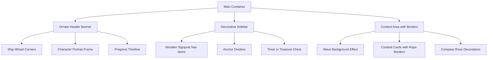

# Nautical UI Redesign Plan

## Overview
Transform the DeutschTagebuch app into an immersive nautical journey experience with ornate decorations, bronze/copper tones, and a horizontal progress timeline inspired by the One Piece voyage map aesthetic.

## Design Vision

### Color Palette Transformation
**Current Colors:**
- Background: Light parchment (#f4e4bc)
- Wood: #AF6528
- Primary Actions: Blue/Red

**New Palette:**
```css
--bronze-light: #CD7F32
--bronze-medium: #B8860B
--bronze-dark: #8B6914
--copper: #B87333
--ocean-deep: #1e3a5f
--ocean-mid: #2E5090
--ocean-light: #60BFF5
--sea-foam: #98D8C8
--parchment-warm: #F4E7D7
--gold-accent: #FFD700
--rope-brown: #8B4513
```

### Key Design Elements

#### 1. Ornate Decorative Borders
- Ship wheels in corners of cards
- Anchor motifs as section dividers
- Crossed swords for headers
- Compass roses for navigation
- Rope/chain patterns along edges

#### 2. Horizontal Progress Timeline (Dashboard)
Replace the current chart-based dashboard with a visual journey map showing:
- Day milestones as islands/ports along a route
- Character avatars at progress points
- Decorative ships sailing between points
- Water/wave animations beneath the timeline
- Treasure chest icons for achievements

#### 3. Enhanced Navigation
Transform the sidebar navigation from simple buttons to:
- Ornate wooden signposts
- Each menu item in a decorative frame
- Character portraits integrated into nav items
- Animated hover states with ship wheel rotations
- Metallic shine effects on active items

#### 4. Mobile Responsiveness Strategy
- Collapsible ornate menu with slide-in animation
- Vertical timeline on mobile (stacked journey)
- Touch-friendly decorative buttons (min 44px)
- Simplified decorations on small screens
- Maintain bronze/copper theming

## Component Breakdown

### Layout Structure



### Specific UI Updates

#### Dashboard
- **Header**: Ornate banner with ship wheels in corners
- **Timeline**: Horizontal journey map with 30 day milestones
  - Days 1-10: Starting islands with simple ships
  - Days 11-20: Mid-journey with larger vessels
  - Days 21-30: Grand Line with epic ship
- **Stats Cards**: Treasure chest styled containers
- **Chart**: Remove and replace with visual journey progress

#### Journal Section
- **Input Areas**: Parchment texture with rope borders
- **History**: Scroll-like design with wax seal icons
- **Buttons**: Wooden plank style with metal rivets

#### Vocabulary Bank
- **Word Cards**: Wanted poster aesthetic (already present, enhance with borders)
- **Categories**: Treasure map folders with aged paper look
- **Add Word Form**: Captain's log book styling

#### Navigation
- **Desktop**: Wooden ship deck plank design
- **Mobile**: Collapsible treasure map style
- **Icons**: Custom nautical SVG icons
- **Active State**: Glowing gold border effect

## CSS Architecture

### New Utility Classes
```css
.ornate-border-bronze { /* Ship wheel corner decorations */ }
.rope-divider { /* Rope/chain separators */ }
.water-wave-bg { /* Animated wave background */ }
.treasure-chest { /* Container for stats/timer */ }
.wooden-plank { /* Navigation buttons */ }
.compass-accent { /* Decorative compass roses */ }
.anchor-divider { /* Section separators */ }
.ship-wheel-spinner { /* Animated loading states */ }
```

### Animation Effects
1. **Wave Motion**: Gentle horizontal scrolling water
2. **Ship Sail**: Floating ships on timeline
3. **Wheel Rotation**: Spinning ship wheels on hover
4. **Sparkle**: Gold shimmer on achievements
5. **Page Transitions**: Sail-in/out effects

## Mobile-First Responsive Design

### Breakpoints
- **Mobile**: < 768px - Simplified decorations, vertical timeline
- **Tablet**: 768px - 1024px - Moderate decorations, horizontal timeline
- **Desktop**: > 1024px - Full ornate experience

### Mobile Optimizations
- Reduce border complexity
- Stack timeline vertically
- Simplify SVG decorations
- Touch-friendly buttons (min 48px)
- Collapsible sections

## Implementation Strategy

### Phase 1: Foundation
- Update color variables
- Create base decorative components
- Implement water background

### Phase 2: Navigation
- Transform sidebar design
- Add ornate borders
- Implement animations

### Phase 3: Timeline
- Build horizontal journey map
- Add milestone markers
- Integrate character progression

### Phase 4: Details
- Add decorative accents throughout
- Implement micro-interactions
- Polish animations

### Phase 5: Mobile
- Responsive layouts
- Mobile-specific decorations
- Touch optimizations

## Technical Considerations

### Performance
- Use CSS for animations (GPU accelerated)
- Lazy load decorative SVGs
- Optimize wave animations with transform
- Minimize repaints with will-change

### Accessibility
- Maintain color contrast ratios (4.5:1 minimum)
- Keep decorations as background elements
- Ensure all interactive elements are keyboard accessible
- Provide alt text for decorative images

### Browser Support
- Modern browsers (Chrome, Firefox, Safari, Edge)
- CSS Grid and Flexbox for layouts
- CSS Custom Properties for theming
- Fallbacks for older browsers

## Assets Needed

### SVG Icons/Decorations
- Ship wheels (4 sizes)
- Anchors (decorative)
- Crossed swords
- Compass roses
- Rope patterns
- Ships (small, medium, large)
- Treasure chests
- Wooden planks
- Wax seals

### Textures
- Wood grain
- Rope texture
- Water waves
- Parchment paper
- Metal bronze/copper

## Success Criteria

✅ All sections have ornate nautical borders
✅ Bronze/copper color scheme implemented throughout
✅ Horizontal progress timeline on dashboard
✅ Water/ocean theming with animations
✅ Navigation transformed with decorative elements
✅ Mobile responsive on all screen sizes
✅ Smooth animations and transitions
✅ Maintains accessibility standards
✅ Performance optimized (60fps animations)

## Notes

- The design should feel like an adventure map/journey
- Every interaction should feel tactile and rewarding
- Maintain the One Piece theme while being functional
- Keep the existing functionality intact
- Ensure the design doesn't overwhelm the content